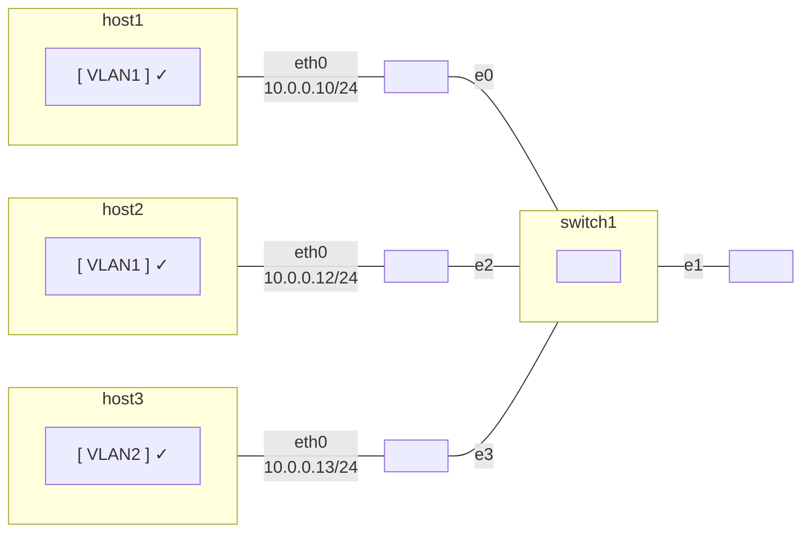

## **Shared Access and Medium Network Architecure**

# **Laboratory Evaluation**

_Academic year 2023-2024_  
_Telematics Engineering Department - Universidad Carlos III de Madrid_

---

## P1
Configure the spanning tree protocol. Configure it such that switch 3 (on the top) is the
root of the tree and switch 1 (on the left) has less priority than switch 2 (on the right). Run the
command `sudo ovs-vsctl list port id_experiment-n2-e0`. What is the `stp-role` of that port?

- [ ] `root`
- [x] `designated` $\checkmark$
- [ ] `alternate`

## P2
Open a terminal in host3. Execute the following command: `ping6 2001::2`. Perform
a Wireshark capture in the eth0 interface. Select an echo request frame.

### P2.A
What is the source MAC address?

- [ ] a. 42:00:aa:00:00:02
- [x] b. 42:00:aa:00:00:03 $\checkmark$
- [ ] c. 42:00:aa:00:00:04

### P2.B
What is the destination MAC address?

- [x] a. 42:00:aa:00:00:04 $\checkmark$
- [ ] b. 42:00:aa:00:00:01
- [ ] c. 42:00:aa:00:00:03
- [ ] d. 42:00:aa:00:00:02

### P2.C
What is the Type field?

- [x] a. 0x86DD $\checkmark$
- [ ] b. 0x0806
- [ ] c. 0x0800

## P3
Drag and drop the markers to identify the hosts belonging to VLAN1 and VLAN2

## P4
Open a Terminal in host1 and issue the command “ping6 -c 2 ff02::1%eth0”.
Fror the sequence number 1, how many responses are marked with “DUP!”?

- [ ] a. 1
- [ ] b. 2
- [x] c. 3 $\checkmark$
- [ ] d. 0
- [ ] e. 4
